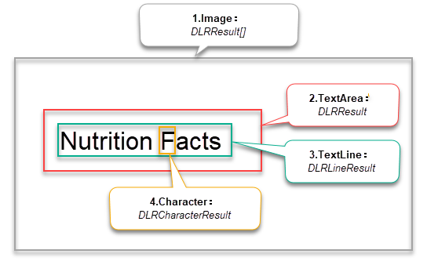

# User Guide - Java

- [User Guide - Java](#user-guide---java)
	- [Requirements](#requirements)
	- [Installation](#installation)
	- [Build your First Application](#build-your-first-application)
		- [Create a New Project](#create-a-new-project)
		- [Include the Label Recognizer library](#include-the-label-recognizer-library)
			- [Option 1: Add the Libraries Manually](#option-1-add-the-libraries-manually)
			- [Option 2: Add the Libraries via Maven](#option-2-add-the-libraries-via-maven)
		- [Initialize the Label Recognizer](#initialize-the-label-recognizer)
		- [Recognition Process and How to Use the Results](#recognition-process-and-how-to-use-the-results)
		- [Build and Run the Project](#build-and-run-the-project)

## Requirements

- Operating systems:
   - Windows 7, 8, 10
   - Windows Server 2003, 2008, 2008 R2, 2012
   - Linux x64 (Ubuntu 14.04.4+ LTS, Debian 8+, etc.)
   - JDK 1.7 and above

- Environment: Eclipse 3.7 and above.

## Installation

If you don't have SDK yet, please go to <a href="https://www.dynamsoft.com/survey/dlr/?utm_source=docs" target="_blank">Dynamsoft website</a> to get it. After the sdk is decompressed, the root directory of the DLR installation package is `DynamsoftLabelRecognizer`, which is represented by `[INSTALLATION FOLDER]`.

## Build your First Application

Let's start by creating a console application which demonstrates how to use the minimum code to recognize text from an image file.

>You can download the similar complete source code from [Here](https://github.com/Dynamsoft/label-recognizer-java-samples/tree/master/samples/HelloWorld).

### Create a New Project

1. Open Eclipse. Go to File > New > Project,  create a new Java project `DLRJavaSample`.

2. Add a new Class named `DLRJavaSample` into the project.

### Include the Label Recognizer library

There are two ways to add the libraries into your project - **Manually** and **Maven**.

#### Option 1: Add the Libraries Manually

1. Click File > Properties > Java Build Path > Libraries > Add external JARs

2. add `dynamsoft-labelrecognizer-{version number}.jar` and `dynamsoft-core-{version number}.jar` click Apply.

>Note: The JAR file can be found at `[INSTALLATION FOLDER]\lib`.

#### Option 2: Add the Libraries via Maven

1. Include the following repository configuration in your pom.xml file:

    ```xml
    <repositories>
        <repository>
            <id>dlr</id>
            <url>https://download2.dynamsoft.com/maven/jar</url>
        </repository>
    </repositories>
    ```

2. Add the following dependencies to your pom.xml file:

    ```xml
    <dependencies>
        <dependency>
            <groupId>com.dynamsoft</groupId>
            <artifactId>dlr</artifactId>
            <version>2.2.10</version>
        </dependency>
        <dependency>
            <groupId>com.dynamsoft</groupId>
            <artifactId>dc</artifactId>
            <version>1.0.0</version>
        </dependency>
    </dependencies>
    ```

### Initialize the Label Recognizer

1. Import the package in the file `DLRJavaSample.java`

    ```java
    import com.dynamsoft.dlr.*;
    ```

2. Initialize the license key

    ```java
    // 1.Initialize license.
    LabelRecognizer.initLicense("DLS2eyJvcmdhbml6YXRpb25JRCI6IjIwMDAwMSIsInByb2R1Y3RzIjoyfQ==");
    ```

    >Note:
    >- Network connection is required for the license to work.
    >- "DLS2***" is a default free public trial license used in the sample.
    >- You can request a 30-day trial license via the [Request a Trial License](https://www.dynamsoft.com/customer/license/trialLicense?product=dlr&utm_source=guide&package=java){:target="_blank"} link.

3. Create an instance of Dynamsoft Label Recognizer

    ```java
    // 2.Create an instance of Label Recognizer.
    LabelRecognizer dlr = new LabelRecognizer();
    ```

### Recognition Process and How to Use the Results

1. Recognizing text in an image 

    ```java
    DLRResult[] results = null;

    try {
        results = dlr.recognizeByFile("../../SampleImages/dlr-sample-vin.png", "");
    } catch (LabelRecognizerException ex) {
        ex.printStackTrace();
    }
    ```

    >You can download the image [dlr-sample-vin.png](../assets/dlr-sample-vin.png) for testing. In addition, you can replace it with the full path of the image you want to recognize.

    >For the error handling mechanism, when an error occurs during the recognition process, an exception will be thrown. You should add codes for error handling based on your needs. Check out [Error Code]({{site.dlr_enumerations}}error-code.html) for full supported error codes.

2. Get and output the recognition results

    ```java
    if (results != null && results.length > 0) {
        for (int i = 0; i < results.length; i++) {
            
            // Get result of each text area (also called label).
            DLRResult result = results[i];
            System.out.println("Result " + i + ":");
            for (int j = 0; j < result.lineResults.length; j++) {
                
                // Get the result of each text line in the label.
                DLRLineResult lineResult = result.lineResults[j];
                System.out.println(">>Line Result " + j + ": " + lineResult.text);
            }
        }
    } else {
        System.out.println("No data detected.");
    }
    ```

    The recognition results of SDK are organized into a four-tier structure: 
    - `DLRResult[]` corresponds to the results of an `image`
    - `DLRResult` corresponds to the result of a `TextArea` (also called Label) 
    - `DLRLineResult` corresponds to the result of each `TextLine` in the Label
    - `DLRCharacterResult` corresponds to the result of each `Character` in the `TextLine`

    The structure is shown in the figure below:

    <div align="center">
    
    <p>Figure 1 – DLR Result Structure</p>
    </div> 

You can download the similar complete source code from [Here](https://github.com/Dynamsoft/label-recognizer-java-samples/tree/master/samples/HelloWorld).

### Build and Run the Project

1. Right click the project, click Run As > Java Application.

